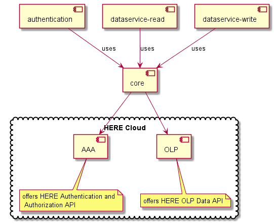

Overall architecture of HERE OLP Edge SDK ++
=============================================

## 1. Abstract

This document describes the overall architecture of the HERE OLP Edge SDK ++ (SDK). For an overview of the scope and the features of the SDK please refer to [README.md](../README.md#why-use-the-sdk).

## 2. Component Overview

The OLP Edge SDK ++ consists of three main independent modules:
* **olp-cpp-sdk-authentication**
* **olp-cpp-sdk-dataservice-read**
* **olp-cpp-sdk-dataservice-write**

Every of this modules has a dependency on the **olp-cpp-sdk-core** module which contains a set of utilities shared among all modules.

In the following sections every of this modules will be described.

### 2.1. Component Detail

The following component diagram shows the overview of the SDK components and their relationship with the HERE Cloud.

#### 2.1.1. olp-cpp-sdk-core

The core module offers the following platform independent functionality:
* **cache**: on-disk and in-memory cache
* **client**: generic HTTP client performing the communication with the HERE OLP
* **geo**: geo utilities
* **logging**: logging to file, console or any customer defined logger
* **math**: geo math utilities
* **network**: abstracts network implementation on the supported platforms
* **thread**: utility classes commonly useful in concurrent programming
* **utils**: some utilities like base64, LRU cache etc.

#### 2.1.2. olp-cpp-sdk-authentication

The authentication module wraps the HERE Authentication and Authorization REST API. It's an OAuth 2.0 compliant REST API that allows you to obtain short-lived access tokens which are used to authenticate requests to HERE services. Tokens expire after 24 hours.

For the detailed information about how to use this module please take a look at the SDK examples.

#### 2.1.3. olp-cpp-sdk-dataservice-read

The dataservice-read module abstracts a subset of the HERE Open Location Platform Data REST API related to reading data from OLP catalogs. It allows reading data of the following layer types:
* Versioned layer. Used Data APIs:
  - [Config API](https://developer.here.com/olp/documentation/data-store/api-reference-config.html)
  - [Metadata API](https://developer.here.com/olp/documentation/data-store/api-reference-metadata.html)
  - [Query API](https://developer.here.com/olp/documentation/data-store/api-reference-query.html)
  - [Blob API](https://developer.here.com/olp/documentation/data-store/api-reference-blob.html)
* Volatile layer. Used Data APIs:
  - [Config API](https://developer.here.com/olp/documentation/data-store/api-reference-config.html)
  - [Metadata API](https://developer.here.com/olp/documentation/data-store/api-reference-metadata.html)
  - [Query API](https://developer.here.com/olp/documentation/data-store/api-reference-query.html)
  - [Volatile API](https://developer.here.com/olp/documentation/data-store/api-reference-volatile-blob.html)
* Index layer (**not supported yet**). Used Data APIs:
  - [Index API](https://developer.here.com/olp/documentation/data-store/api-reference-index.html)
  - [Blob API](https://developer.here.com/olp/documentation/data-store/api-reference-blob.html)
* Stream layer (**not supported yet**). Used Data APIs:
  - [Stream API](https://developer.here.com/olp/documentation/data-store/api-reference-stream.html)
  - [Blob API](https://developer.here.com/olp/documentation/data-store/api-reference-blob.html)

For the detailed information about how to use this module please take a look at the SDK examples.

#### 2.1.4. olp-cpp-sdk-dataservice-write

The dataservice-write module abstracts a subset of the HERE Open Location Platform Data REST API related to writing data to OLP catalogs. It allows writing data of the following layer types:
* Versioned layer. Used Data APIs:
  - [Publish API](https://developer.here.com/olp/documentation/data-store/api-reference-publish.html)
  - [Blob API](https://developer.here.com/olp/documentation/data-store/api-reference-blob.html)
* Volatile layer. Used Data APIs:
  - [Publish API](https://developer.here.com/olp/documentation/data-store/api-reference-publish.html)
  - [Volatile API](https://developer.here.com/olp/documentation/data-store/api-reference-volatile-blob.html)
* Index layer. Used Data APIs:
  - [Index API](https://developer.here.com/olp/documentation/data-store/api-reference-index.html)
  - [Blob API](https://developer.here.com/olp/documentation/data-store/api-reference-blob.html)
* Stream layer. Used Data APIs:
  - [Ingest API](https://developer.here.com/olp/documentation/data-store/api-reference-ingest.html)
  - [Publish API](https://developer.here.com/olp/documentation/data-store/api-reference-publish.html)
  - [Blob API](https://developer.here.com/olp/documentation/data-store/api-reference-blob.html)

For the detailed information about how to use this module please take a look at the SDK examples.

### 2.2. External Dependencies and Depending Systems

See [README.md](../README.md#Dependencies)

## 3. Requirements Overview

The requirements break down into feature and non-functional requirements.

### 3.1. Feature Requirements

#### 3.1.1. Authentication
Feature                          |  Status
---------------------------------|--------------
Sign-In with Client Credentials  | Implemented
Sign Up with Email and Password  | Implemented
Sign Up with Facebook            | Implemented
Sign Up with Google              | Implemented
Sign Up with ArcGIS              | Implemented
Sign In with Refresh Token       | Implemented
Log Out                          | Implemented
Accept terms                     | Implemented

#### 3.1.2. Dataservice-read

Feature                          |  Status
---------------------------------|--------------
Reading from Versioned layer     | Implemented
Reading from Volatile layer      | Implemented
Reading from Stream layer        | Implemented
Reading from Indexed layer       | Implemented
Lookup API                       | Implemented
Get Catalog and Layer Configuration | Implemented
Get Partition Metadata for all partitions | Implemented
Get Partition Metadata for a subset of partitions | Planned
Statistics API  | Planned

#### 3.1.3. Dataservice-write

Feature                          |  Status
---------------------------------|--------------
Writing to Versioned layer       | Implemented
Writing to Volatile layer        | Implemented
Writing to Stream layer          | Implemented
Writing to Indexed layer         | Implemented
Lookup API                       | Implemented

#### 3.1.4. Additional features

Feature                          |  Status
---------------------------------|--------------
LRU Caching                      | Implemented
Prefetching data strategies      | Planned
Off-line capabilities            | Planned

### 3.2. Non-Functional Requirements

The non-functional requirements are being finalized. After that this section will be updated.

## 4. Security Model

The user of the OLP Edge SDK ++ is responsible to take care of any security and privacy requirements of the target system.
